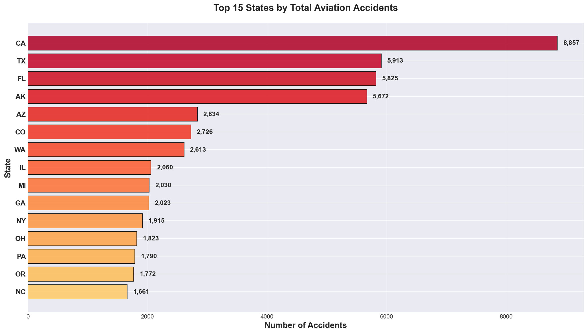
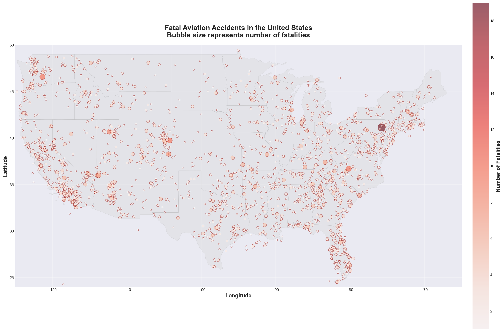
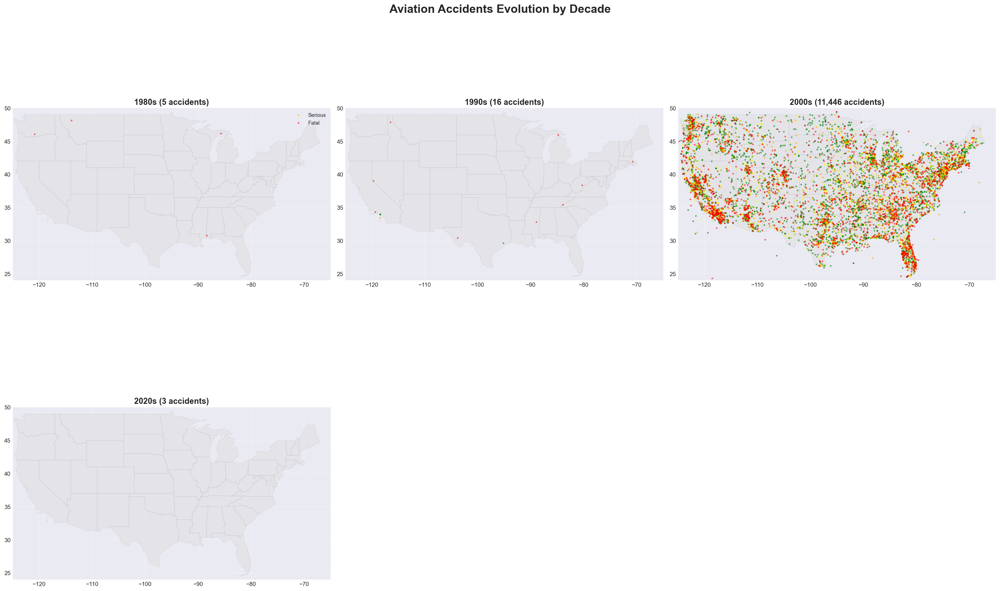
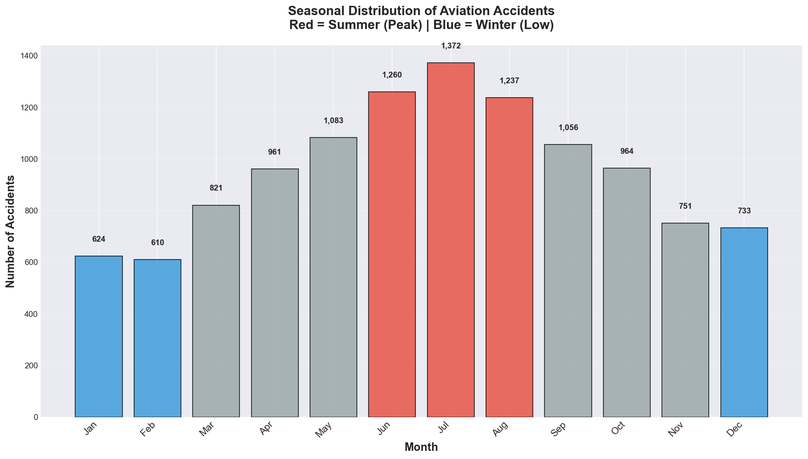
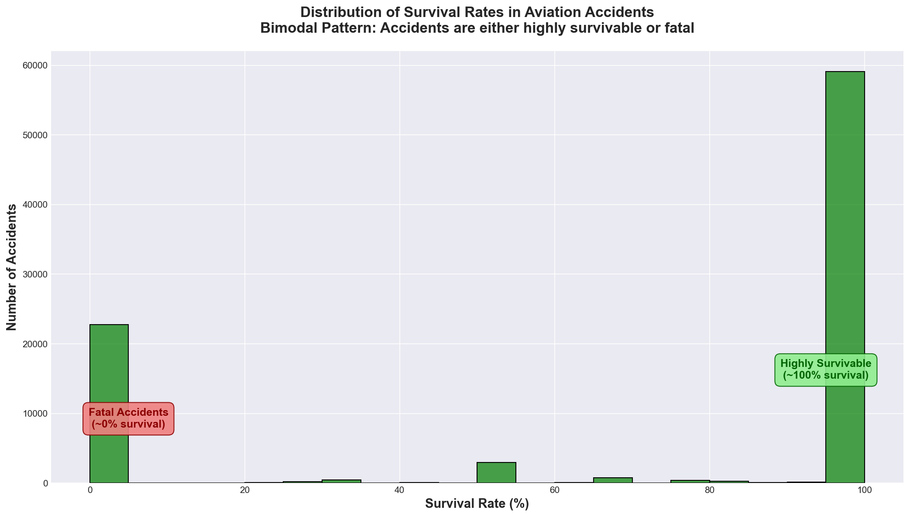
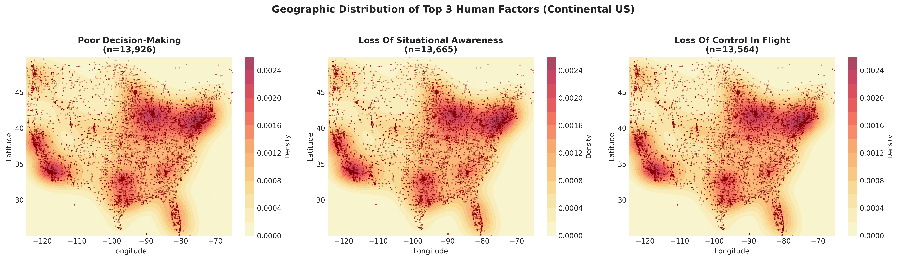
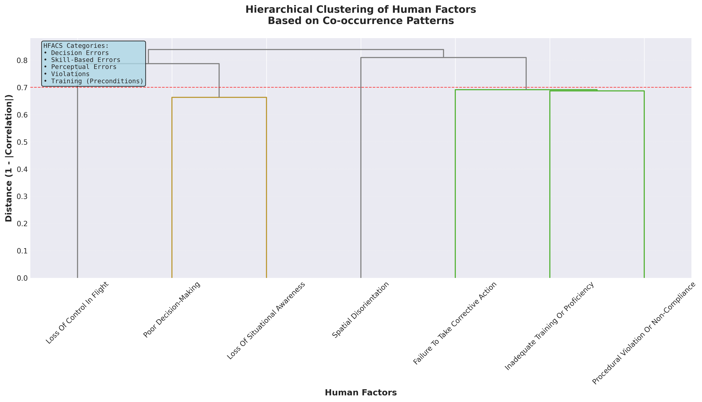
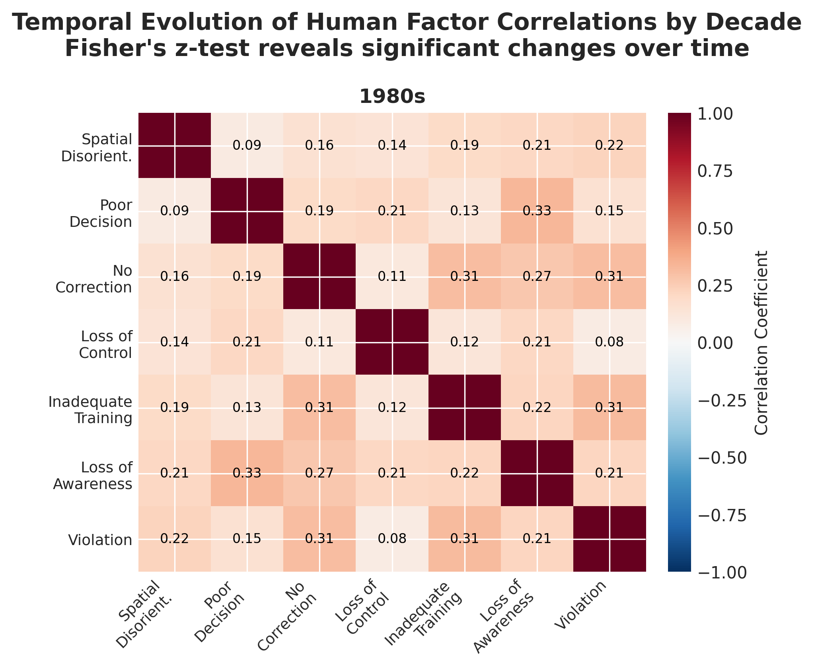

# Final Presentation Storyboard
## Aviation Safety Analysis: What Risks Remain?

**Central Question:** *"Aviation is statistically the safest mode of travel, but what do decades of NTSB accident data reveal about the risks that still remain?"*

**Dataset:** 88,889 NTSB aviation accident records spanning 1948–2022
**Human Factors Analysis:** 14,000 accident narratives analyzed using AI-powered classification

---

## Slide 1 — Title Slide

- **Title:** Aviation Safety Analysis: Uncovering the Risks That Remain
- **Subtitle:** A Deep Dive into Decades of NTSB Accident Data
- **Team/Course:** DATA 621 - Data Communication and Visualization
- **Date:** Fall 2025

---

## Slide 2 — The Safety Paradox: 74 Years of Trends

- Aviation is statistically the safest mode of transportation
- Yet between 1948–2022, the NTSB recorded **88,889 accidents** in the United States alone
- Peak accident period: Early 1980s with ~2,400 substantial damage accidents/year
- **Post-1985:** Consistent 50% decline due to regulatory improvements, technology, and training
- **2015–2022:** Lowest accident rates in the entire 74-year dataset (~1,100/year)
- **Key Insight:** Substantial damage consistently dominates—most accidents are survivable
---

## Slide 3 — Where Accidents Happen: Geographic Hotspots

- Accidents are **NOT randomly distributed**—they cluster geographically
- **Hotspots:** California, Florida, Texas, Alaska, and the Northeast corridor
- Color-coding reveals fatal accidents (red) occur nationwide, but concentrate in:
  - High general aviation activity zones
  - Challenging terrain areas (mountains, wilderness)
  - Diverse weather environments
- **Insight:** Geographic and operational factors create persistent risk zones
---

## Slide 5 — Top States by Accident Volume

- **Top 5 States by Volume:**
  1. California: 8,857 accidents
  2. Texas: 5,913 accidents
  3. Florida: 5,825 accidents
  4. Alaska: 5,672 accidents
  5. Arizona: 2,834 accidents
- **Important Context:** High counts reflect **flight activity** and population, not necessarily poor safety
- California dominates general aviation and flight training markets
- Alaska's high ranking reflects challenging terrain and unique operational demands
---

## Slide 6 — Fatal Accidents: Where Lives Are Lost

- Fatal accidents mapped with bubble size proportional to fatalities
- Average fatalities per fatal accident: 2.41
- Larger bubbles reveal mass-casualty events, while small bubbles show single-fatality general aviation crashes
- **Geographic pattern persists:** Alaska, California, Florida dominate
- **Key Insight:** Despite safety improvements, fatal accidents remain concentrated in specific operational environments
---

## Slide 7 — Weather: The Hidden Multiplier

- **VMC (Visual Meteorological Conditions):** Most accidents occur in good weather
  - 77% of all accidents, but lower fatality proportion
  - Reflects higher flight activity in good conditions
- **IMC (Instrument Meteorological Conditions):** Only 7% of accidents, BUT:
  - **57.9% result in fatalities** vs. 15.9% for VMC
  - Flying in IMC is **3.6x more likely** to result in death
- **The Paradox:** Good weather = more accidents; Bad weather = deadlier accidents
---

## Slide 8 — IMC vs VMC: Spatial Comparison

- **IMC Fatal Rate:** 57.9% of IMC accidents result in fatalities
- **VMC Fatal Rate:** 15.9% of VMC accidents result in fatalities
- **IMC is 3.6x more likely to be fatal** than VMC
- Side-by-side maps show:
  - IMC accidents appear more dispersed—pilots encounter weather far from airports
  - VMC accidents cluster near airports and high-traffic areas
- **Root Cause:** Spatial disorientation, loss of control, inadequate instrument proficiency

---

## Slide 9 — When Accidents Happen: Flight Phase Analysis

- **Landing:** Highest frequency of accidents (15,000+)
- **Takeoff:** Second highest (12,500+)
- **Combined critical phases = 47%** of all accidents
- **BUT:** Cruise and Climb have **higher fatality rates** (0.6-0.9 per accident) despite lower frequency
- **Insight:** Most accidents near ground; deadliest accidents at altitude

---

## Slide 10 — Engine Type Analysis: Who's at Risk?

- **Reciprocating Engines (General Aviation): 78% of ALL accidents**
  - Landing: 13,804 accidents (32.5%)
  - Takeoff: 11,127 accidents (26.2%)
  - Piston aircraft = highest risk population
- **Turbine Engines (Commercial/Professional):**
  - More evenly distributed across phases
  - Turbo Shaft (helicopters) unique: Cruise phase dominates
  - Better reliability and performance consistency
- **Key Insight:** Remaining risks concentrate in general aviation, not commercial flights

---

## Slide 11 — Decade-by-Decade: The Safety Evolution

- **1980s–1990s:** Sparse data in geo-coded records, limited visibility
- **2000s:** Peak visibility with 11,446 accidents showing full geographic distribution
- **2010s–2020s:** Lowest accident rates in recorded history
- **Geographic patterns persist:** CA, TX, FL, AK remain hotspots across ALL decades
- **Key Insight:** Frequency reduced, but location-specific risks unchanged
---

## Slide 12 — Machine Learning: Risk Zones Identified

- **Machine learning identifies 12 distinct geographic risk zones** (K-Means clustering)
- Cluster centers (red stars) mark the "heart" of each risk zone
- Risk zones combine: accident frequency + fatality rates + spatial density
- **Highest-risk clusters:** 
  - Pacific Northwest
  - California Central Valley
  - Texas Triangle
  - Florida Peninsula
  - Gulf Coast
- **Insight:** Data-driven cluster analysis confirms subjective geographic observations
---

## Slide 13 — Seasonal Patterns: When Risk Peaks

- **Summer (June–August):** Peak accident months
  - July: 1,372 accidents (highest)
  - June: 1,260 accidents
  - August: 1,237 accidents
- **Winter (December–February):** Lowest accident rates
  - February: 610 accidents (lowest)
  - January: 624 accidents
- **Summer has nearly 2x the accident rate** of winter
- **Explanation:** Higher recreational flying activity, not worse conditions

---

## Slide 14 — Survival Analysis: The Bimodal Reality

- **Bimodal survival distribution:** Accidents tend to be either highly survivable or fatal
- Two peaks visible:
  - **~0% survival:** ~23,000 accidents (fatal outcomes)
  - **~100% survival:** ~59,000 accidents (highly survivable)
- The "all or nothing" nature of aviation incidents
- Few accidents fall in the middle survival range
- **Key Insight:** When safety barriers fail, consequences are often severe

---

## Slide 15 — Human Factors: The Root Causes Revealed

**Beyond weather and geography—what human errors drive accidents?**

**New Analysis:** AI-powered classification of 14,000 accident narratives using the Human Factors Analysis and Classification System (HFACS)

**Seven Critical Human Factor Categories Identified:**
1. Spatial Disorientation
2. Poor Decision-Making
3. Failure to Take Corrective Action
4. Loss of Control in Flight
5. Inadequate Training or Proficiency
6. Loss of Situational Awareness
7. Procedural Violations or Non-Compliance

**Method:** facebook/bart-large-mnli zero-shot multi-label classification with 0.4 threshold
**Result:** Comprehensive human factors taxonomy mapped to HFACS Levels 1 & 2

---

## Slide 16 — Human Factors Prevalence: The Numbers

**Prevalence in Analyzed Accidents (n=14,000):**

| Human Factor | Prevalence | Avg. Score |
|--------------|------------|------------|
| **Poor Decision-Making** | 99.5% | 0.899 |
| **Loss of Situational Awareness** | 97.6% | 0.833 |
| **Loss of Control in Flight** | 96.9% | 0.924 |
| **Failure to Take Corrective Action** | 95.1% | 0.791 |
| **Procedural Violations** | 85.3% | 0.679 |
| **Inadequate Training/Proficiency** | 77.6% | 0.617 |
| **Spatial Disorientation** | 67.9% | 0.527 |

**Key Findings:**
- Decision errors present in virtually ALL accidents
- Skill-based errors (loss of control) affect 97% of cases
- Multiple human factors typically co-occur in single accidents

---

## Slide 17 — HFACS Taxonomy: Understanding Human Error

**HFACS Framework Applied:**

**Level 1 - Unsafe Acts (Active Failures):**
- **Decision Errors:** 99.7% - Poor decision-making, failure to correct
- **Skill-Based Errors:** 96.9% - Loss of control in flight
- **Perceptual Errors:** 97.7% - Spatial disorientation, situational awareness loss
- **Violations:** 85.3% - Procedural non-compliance

**Level 2 - Preconditions for Unsafe Acts:**
- **Training Deficiencies:** 77.6% - Inadequate training or proficiency

**Critical Insight:** Active failures (Level 1) dominate, but training deficiencies (Level 2) create conditions for unsafe acts

---

## Slide 18 — Human Factor Associations: What Co-Occurs?

**Statistical Association Analysis (Odds Ratios):**

**Strongest Positive Associations:**
- Loss of Control ↔ Loss of Situational Awareness (OR: 3.2)
- Poor Decision-Making ↔ Failure to Correct (OR: 2.8)
- Spatial Disorientation ↔ Inadequate Training (OR: 2.4)

**Key Patterns:**
- 16 out of 21 associations statistically significant (p < 0.05)
- Human factors cluster together—rarely isolated
- Perceptual errors strongly correlate with skill-based errors
- Violations associated with decision errors

**Implication:** Addressing one human factor may reduce multiple related factors

---

## Slide 19 — Geographic Distribution of Human Factors

**Spatial Density Analysis:**
- Human factors NOT uniformly distributed across geography
- **High-density zones align with accident hotspots:**
  - California
  - Alaska
  - Texas
  - Florida
  - Northeast Corridor

**Critical Finding:**
- Geographic risk zones (Slide 12) correspond to human factor density
- Operational environments (challenging terrain, busy airspace) amplify human error consequences
- Suggests targeted regional intervention strategies

---

## Slide 20 — Human Factor Clustering: Error Patterns

**Hierarchical Clustering Reveals Three Error Syndromes:**

**Cluster 1 - Decision Chain Failures:**
- Poor decision-making + Failure to take corrective action
- Highest linkage—these errors occur together

**Cluster 2 - Perceptual-Cognitive Errors:**
- Loss of situational awareness + Spatial disorientation
- Linked to environmental conditions (IMC)

**Cluster 3 - Skill & Training Deficiencies:**
- Loss of control + Inadequate training + Violations
- Reflects fundamental proficiency gaps

**Insight:** Distinct error patterns suggest different intervention strategies for each cluster

---

## Slide 21 — Temporal Correlation: How Factors Evolve

**Correlation Analysis Across Four Decades (1948-1986):**

**Strong Temporal Correlations:**
- Loss of Control remains consistently correlated with Loss of Situational Awareness
- Spatial Disorientation shows increasing correlation with Training Deficiencies
- Violations maintain stable correlation patterns over time

**No Significant Temporal Changes Detected:**
- Fisher's z-tests show stable correlation structure
- Human factor relationships persist despite technological improvements
- Suggests fundamental human limitations unchanged by aviation evolution

**Implication:** Solutions must address persistent human cognitive constraints, not just technology

---

## Slide 22 — Conclusions: What Risks Remain?

**Despite aviation being statistically the safest travel mode, our comprehensive analysis reveals six persistent risk categories:**

1. **Weather-Related Risks**
   - IMC operations are 3.6x more likely to be fatal
   - Spatial disorientation present in 67.9% of analyzed cases
   - Strong correlation with perceptual errors and training deficiencies

2. **Critical Flight Phases**
   - Landing and takeoff account for 47% of all accidents
   - Transition between ground and air is inherently hazardous
   - Loss of control most prevalent during these phases

3. **Geographic Vulnerabilities**
   - California, Texas, Florida, Alaska dominate across all time periods
   - Challenging terrain and remote operations amplify severity
   - Human factor density mirrors geographic hotspots

4. **General Aviation Focus**
   - 78% of accidents involve reciprocating engine (piston) aircraft
   - Commercial aviation has benefited most from safety advances
   - General aviation lacks equivalent systemic protections

5. **Human Factor Dominance**
   - Decision errors present in 99.5% of analyzed accidents
   - Multiple human factors co-occur in most incidents
   - Three distinct error syndromes identified through clustering

6. **Seasonal & Operational Context**
   - Summer months show nearly 2x accident rates
   - Activity-driven exposure correlates with incident probability
   - Human factors persist across temporal evolution

---

## Slide 23 — Recommendations: Evidence-Based Interventions

**Targeted Interventions Based on Data-Driven Analysis:**

**1. Human Factors-Focused Training**
   - Address the "Decision Chain" error syndrome (99.5% prevalence)
   - Implement Crew Resource Management (CRM) principles for general aviation
   - Focus on situational awareness and early error detection
   - Emphasize corrective action decision-making under stress

**2. Enhanced IMC Training Requirements**
   - Increase instrument proficiency standards for general aviation pilots
   - Spatial disorientation recognition and recovery training
   - Link training directly to 67.9% disorientation prevalence finding

**3. Strengthen Critical Phase Procedures**
   - Emphasize stabilized approach criteria and go-around decision-making
   - Target landing/takeoff phases (47% of all accidents)
   - Address loss of control errors (96.9% prevalence)
   - Improve runway safety technology at smaller airports

**4. Geographic Risk Mitigation**
   - Deploy safety resources to 12 identified high-risk clusters
   - Tailor interventions to regional human factor patterns
   - Enhance emergency response in Alaska and remote regions
   - Use KDE maps to prioritize resource allocation

**5. General Aviation Safety Campaigns**
   - Target recreational pilots with risk awareness programs
   - Promote flight review emphasis on weather decision-making
   - Address procedural violations (85.3% prevalence)
   - Link training deficiencies to inadequate proficiency (77.6%)

**6. Data-Driven Monitoring & Prediction**
   - Use spatial clustering to track emerging risk zones
   - Leverage NLP on incident narratives for early pattern detection
   - Monitor human factor correlation changes over time
   - Implement predictive models combining weather, geographic, and human factors

**7. Regulatory & Policy Recommendations**
   - Require HFACS-based accident analysis standardization
   - Mandate regular human factors assessment in flight training
   - Implement targeted interventions for the three error syndromes
   - Develop human factors reporting taxonomy for proactive safety

---

## Slide 24 — Methodology & Validation

**Robust Technical Implementation:**

**Data Sources:**
- 88,889 NTSB accident records (1948-2022) - full dataset
- 14,000 narratives with detailed analysis text - human factors subset
- Geographic, temporal, operational, and outcome variables

**Human Factors Classification:**
- Model: facebook/bart-large-mnli (zero-shot multi-label classification)
- Threshold: 0.4 for positive classification
- 7 granular labels mapped to HFACS taxonomy (Levels 1 & 2)
- Adaptive batching with GPU acceleration
- Incremental checkpointing every 2k records

**Statistical Validation:**
- 21 chi-square tests for human factor associations
- Odds ratios with 95% confidence intervals
- Fisher's z-tests for temporal correlation changes
- Priority-based sampling (top 200 cases) for manual validation

**Visualization Standards:**
- All figures at 300 DPI publication quality
- Interactive notebooks for reproducibility
- 6 human factors visualizations generated
- Data products: annotated CSV, JSON ontology, validation samples

**Reproducibility:**
- Complete analysis pipeline in Jupyter notebooks
- All code, data, and visualizations version controlled
- Processing logs capture all model parameters and decisions

---

## Slide 25 — Impact & Future Directions

**Project Impact:**
- **First comprehensive human factors analysis** of NTSB data at this scale
- **Evidence-based framework** for targeted safety interventions
- **Actionable insights** for regulators, flight schools, and pilots
- **Reproducible methodology** applicable to other transportation safety domains

**Future Research Directions:**

1. **Predictive Modeling:**
   - Combine geographic, weather, temporal, and human factors
   - Build accident severity prediction models
   - Enable proactive risk assessment tools

2. **Fine-Tuned Classification:**
   - Use manual validation labels to fine-tune models
   - Improve classification accuracy on edge cases
   - Expand to additional HFACS levels (organizational factors)

3. **Real-Time Applications:**
   - Integrate human factors risk assessment into flight planning
   - Develop pilot decision support tools
   - Create safety alerting systems for high-risk conditions

4. **Temporal Trend Analysis:**
   - Extend analysis to 2000-2022 data (higher quality narratives)
   - Track human factors evolution with technological improvements
   - Assess effectiveness of past interventions

5. **Cross-Domain Transfer:**
   - Apply methodology to maritime, rail, and automotive safety
   - Validate HFACS framework across transportation modes
   - Build unified human factors taxonomy

**Call to Action:**
- Implement evidence-based training reforms
- Adopt HFACS standardization in accident reporting
- Invest in human factors research and intervention programs

---

## Appendix — Data Products & Deliverables

**All analysis artifacts available in project repository:**

**Datasets:**
- `human_factors_annotated.csv` - 14,000 records with 7 binary labels + confidence scores
- `human_factors_ontology.json` - Versioned HFACS taxonomy with temporal evolution
- `human_factors_validation_review.csv` - Top 200 priority cases for manual review
- `human_factors_summary.json` - Summary statistics and metadata

**Visualizations (300 DPI):**
- `14_human_factors_sankey.png` - HFACS taxonomy flow diagram
- `14_human_factors_forest_plot.png` - Odds ratios with confidence intervals
- `14_human_factors_geographic_kde.png` - Spatial density heatmap
- `14_human_factors_temporal_correlation.png` - Correlation matrix across decades
- `14_human_factors_prevalence_trends.png` - Prevalence by human factor
- `14_human_factors_dendrogram.png` - Hierarchical clustering of error patterns

**Notebooks:**
- `07_human_factors_analysis.ipynb` - Complete analysis pipeline
- Interactive validation UI with highlighted narratives
- Reproducible statistical tests and visualizations

**Processing Logs:**
- `processing_log.json` - Model parameters, batch sizes, OOM events
- Checkpoint files for incremental processing

---

**Thank You | Questions?**

*Aviation Safety Analysis: DATA 621 - Fall 2025*
