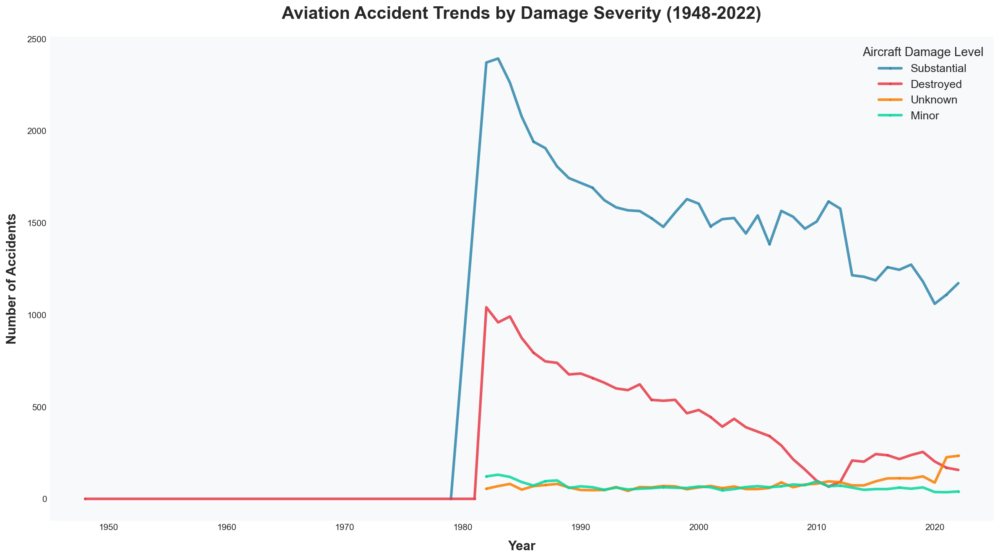
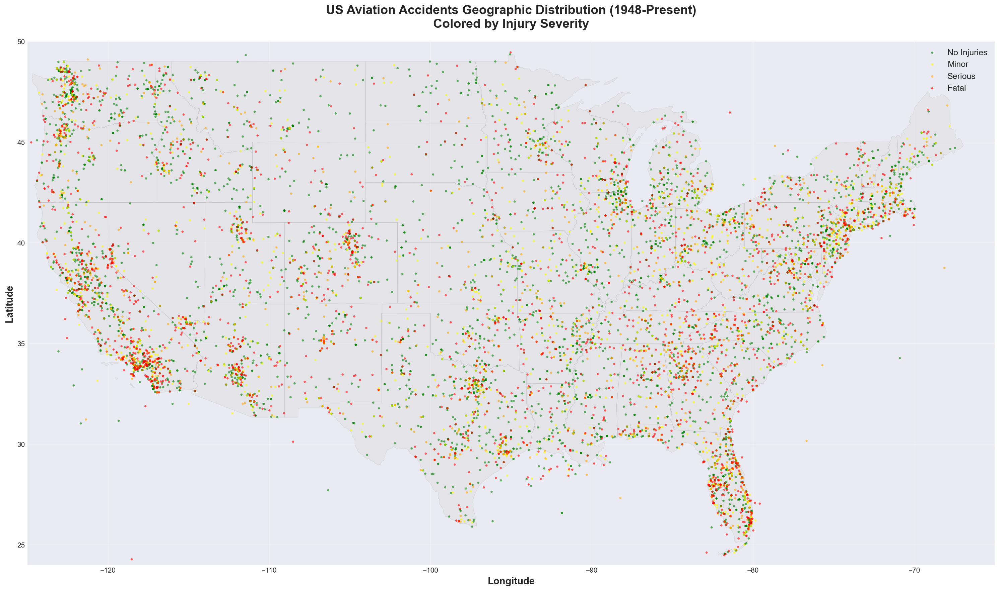
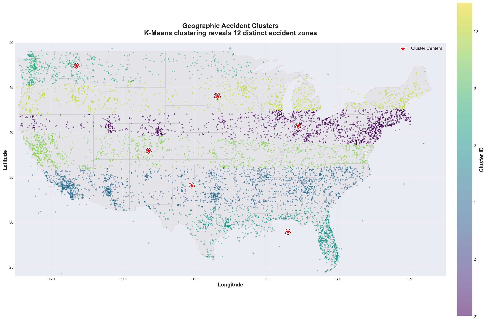
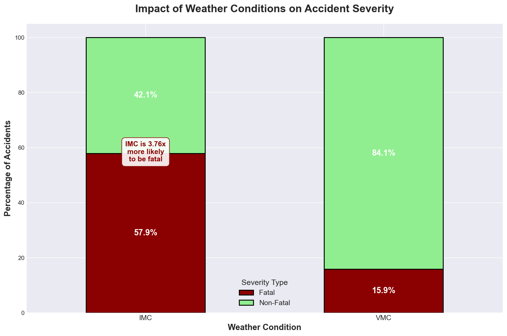
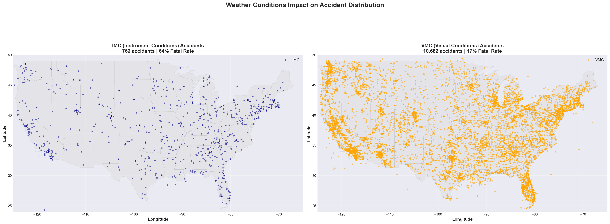
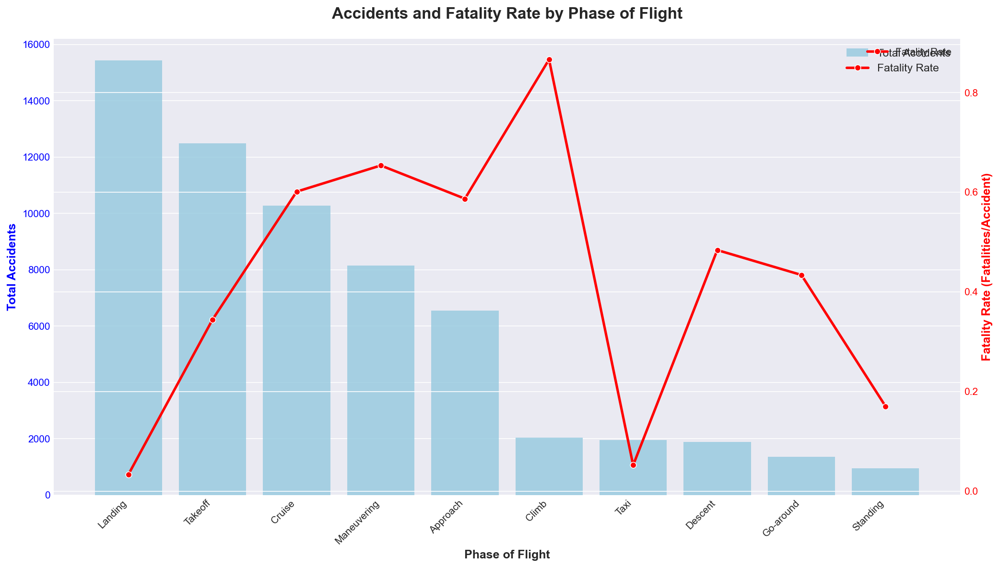
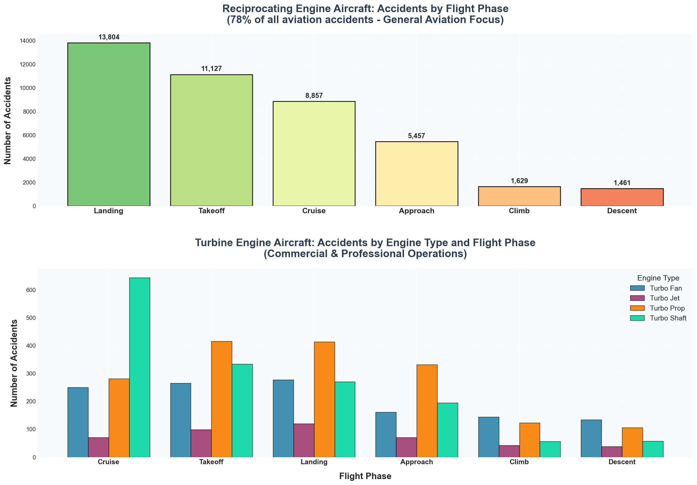
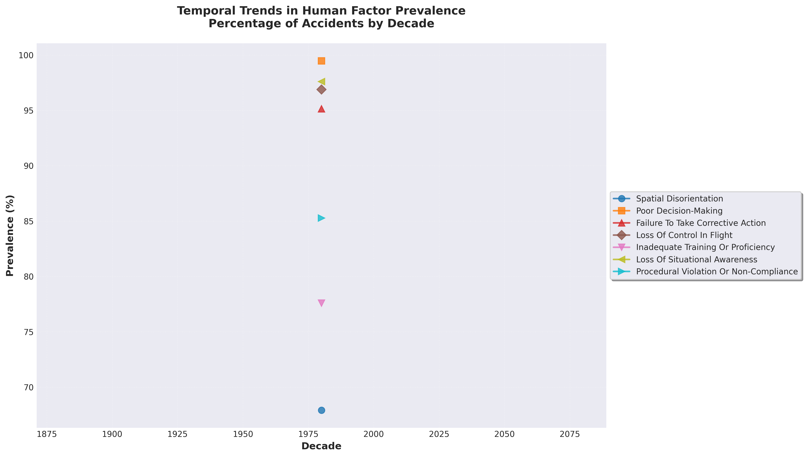
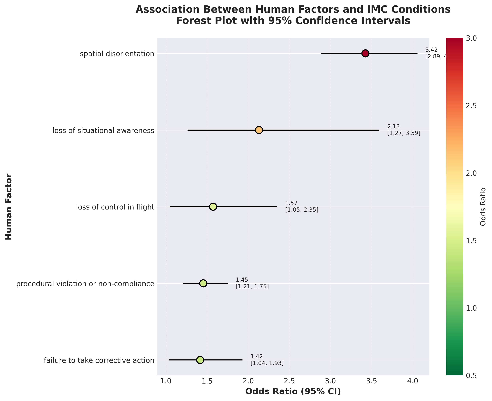

# Aviation Safety Analysis: Uncovering the Risks That Remain
## Condensed Presentation

**DATA 621 - Data Communication and Visualization | Fall 2025**

---

## 1. Why This Matters

**Central Question:** *"Aviation is statistically the safest mode of travel, but what do decades of NTSB accident data reveal about the risks that still remain?"*

**The Paradox:**
- Aviation: safest transportation mode statistically
- Yet: 88,889 NTSB accidents recorded (1948-2022)
- Safety improvements dramatic, but specific risks persist

**Why Study This:**
- Identify remaining vulnerabilities despite overall safety success
- Target interventions where they'll have greatest impact
- Understand human factors driving modern accidents
- Guide policy and training reforms with evidence

---

## 2. Dataset and Methods

**Data Sources:**
- **88,889 NTSB accident records** (1948-2022, full dataset)
- **14,000 accident narratives** with detailed analysis text
- Geographic coordinates, weather conditions, flight phases, outcomes
- Temporal, operational, and severity variables

**Analysis Techniques:**
- **Statistical Analysis:** Temporal trends, severity distributions, seasonal patterns
- **Geospatial Analysis:** Density mapping, hotspot identification
- **Machine Learning:** K-means clustering for 12 geographic risk zones
- **Natural Language Processing:** Zero-shot multi-label classification (BART-large-MNLI)
- **Human Factors Classification:** HFACS taxonomy mapping with 7 error categories
- **Statistical Validation:** Chi-square tests, odds ratios, correlation analysis

**Technical Implementation:**
- GPU-accelerated NLP with adaptive batching
- 300 DPI publication-quality visualizations
- Complete reproducibility in Jupyter notebooks

---

## 3. Safety Trends

**Dramatic Improvements Over 74 Years:**
- **Peak Period:** Early 1980s (~2,400 substantial damage accidents/year)
- **Post-1985:** Consistent 50% decline in accident rates
- **2015-2022:** Lowest rates in history (~1,100/year)
- **Substantial damage** consistently dominates—most accidents survivable

**Key Insight:** Frequency has plummeted, but specific risk patterns persist across all time periods.

---

## 4. Spatial Hotspots

**Accidents NOT Randomly Distributed:**
- **Top 5 States = 34% of all accidents:**
  - California: 8,857 (10.0%)
  - Texas: 5,913 (6.7%)
  - Florida: 5,825 (6.6%)
  - Alaska: 5,672 (6.4%)
  - Arizona: 2,834 (3.2%)

**Machine Learning Identified 12 Risk Zones:**
- Pacific Northwest, California Central Valley, Texas Triangle
- Florida Peninsula, Gulf Coast, Northeast Corridor
- Patterns unchanged across decades

**Key Insight:** Hotspots reflect high flight activity + challenging terrain + weather variability.

---

## 5. Weather Conditions

**The IMC Paradox:**

| Condition | % of Accidents | Fatality Rate | Relative Risk |
|-----------|----------------|---------------|---------------|
| **VMC (Visual)** | 77% | 15.9% | Baseline |
| **IMC (Instrument)** | 7% | 57.9% | **3.6x MORE FATAL** |

**Geographic Patterns:**
- VMC accidents cluster near airports and high-traffic areas
- IMC accidents more dispersed—weather encountered away from airports

**Key Insight:** Most accidents in good weather (activity), but bad weather dramatically deadlier.

---

## 6. Flight Phase Risk

**Critical Phases Dominate:**
- **Landing:** 15,000+ accidents (highest frequency)
- **Takeoff:** 12,500+ accidents (second highest)
- **Combined:** 47% of ALL accidents

**BUT:** Cruise/climb have higher fatality rates (0.6-0.9 per accident)

**General Aviation = 78% of Accidents:**
- Reciprocating engines (piston aircraft) dominate risk profile
- Landing: 32.5% of GA accidents
- Takeoff: 26.2% of GA accidents
- Commercial aviation (turbines) much safer

**Key Insight:** Most accidents near ground; deadliest at altitude. GA lags commercial safety.

---

## 7. NLP Insights

**Advanced Text Analysis on 14,000 Narratives:**

**Method:**
- facebook/bart-large-mnli zero-shot classification
- Multi-label prediction with 0.4 threshold
- 7 human factor categories extracted
- Statistical validation with manual review

**What NLP Revealed:**
- Human factors present in virtually ALL accidents
- Multiple error types co-occur in single incidents
- Three distinct error syndromes identified
- Geographic and temporal patterns in human errors
- Strong statistical associations between factor types

**Technical Achievement:**
- First large-scale HFACS classification of NTSB data
- Reproducible pipeline applicable to other transportation domains
- Validated taxonomy with 16/21 significant associations

---

## 8. Human Factors

**Prevalence in 14,000 Analyzed Accidents:**

| Human Factor | Prevalence | Category |
|--------------|------------|----------|
| **Poor Decision-Making** | 99.5% | Decision Error |
| **Loss of Situational Awareness** | 97.6% | Perceptual Error |
| **Loss of Control in Flight** | 96.9% | Skill-Based Error |
| **Failure to Take Corrective Action** | 95.1% | Decision Error |
| **Procedural Violations** | 85.3% | Violation |
| **Inadequate Training/Proficiency** | 77.6% | Training Deficiency |
| **Spatial Disorientation** | 67.9% | Perceptual Error |

**Three Error Syndromes (Hierarchical Clustering):**
1. **Decision Chain Failures:** Poor decisions + failure to correct
2. **Perceptual-Cognitive Errors:** Awareness loss + disorientation
3. **Skill & Training Deficiencies:** Loss of control + training gaps

**Strongest Statistical Associations:**
- Loss of Control ↔ Loss of Situational Awareness (OR: 3.2)
- Poor Decision-Making ↔ Failure to Correct (OR: 2.8)
- Spatial Disorientation ↔ Inadequate Training (OR: 2.4)

**Key Insight:** Human factors—not equipment—drive virtually all accidents. Multiple factors co-occur.

---

## 9. Key Takeaways

**Despite Dramatic Safety Improvements, Six Risk Categories Persist:**

1. **Weather Vulnerability**
   - IMC 3.6x more fatal than VMC
   - Spatial disorientation in 67.9% of cases

2. **Critical Phase Hazards**
   - Landing/takeoff = 47% of accidents
   - Ground-air transitions inherently dangerous

3. **Geographic Concentration**
   - CA, TX, FL, AK dominate all time periods
   - 12 distinct risk zones identified

4. **General Aviation Gap**
   - 78% of accidents in piston aircraft
   - Commercial aviation much safer

5. **Human Factor Dominance**
   - Decision errors in 99.5% of accidents
   - Three distinct error syndromes
   - Multiple factors co-occur

6. **Activity-Driven Exposure**
   - Summer 2x accident rate vs. winter
   - More flying = more accidents

**The Bottom Line:** Technology has reduced frequency dramatically, but human performance limitations persist. Further safety gains require addressing cognitive errors, not just equipment.

---

## 10. Recommendations

**Evidence-Based Interventions (Prioritized by Impact):**

**HIGH PRIORITY:**

**1. Human Factors-Focused Training**
- Implement Crew Resource Management for general aviation
- Address decision chain failures (99.5% prevalence)
- Train situational awareness and error detection
- Target all three error syndromes with tailored curricula

**2. Enhanced IMC Training Requirements**
- Mandatory spatial disorientation recognition training
- Increase instrument proficiency standards
- Address 3.6x IMC fatality multiplier
- More frequent competency checks

**MEDIUM PRIORITY:**

**3. Critical Phase Procedures**
- Strengthen stabilized approach criteria
- Improve go-around decision-making
- Deploy runway safety tech at smaller airports
- Target 47% of accidents in landing/takeoff

**4. Geographic Risk Mitigation**
- Deploy resources to 12 identified clusters
- Regional interventions for human factor patterns
- Enhanced emergency response in Alaska/remote areas

**5. General Aviation Safety Campaigns**
- Risk awareness for recreational pilots
- Address 85.3% procedural violation rate
- Link training to 77.6% proficiency gaps
- Promote weather decision-making

**ONGOING:**

**6. Data-Driven Monitoring**
- Spatial clustering for emerging risk zones
- NLP for early pattern detection
- Predictive models combining all risk factors
- Track correlation changes over time

**7. Regulatory & Policy Reforms**
- Mandate HFACS-based standardized reporting
- Require regular human factors assessment in training
- Implement targeted interventions for error syndromes

**Expected Impact:** Reduce decision errors, improve IMC safety, target GA sector, enable proactive interventions.

---

## Summary

**What We Learned:**
- 74 years of data reveal persistent risk patterns despite 50% decline in accidents
- Weather, flight phases, geography, and human factors create predictable vulnerabilities
- Human error—especially decision failures—dominates 99.5% of accidents
- General aviation (78% of accidents) lags commercial safety improvements

**What We Recommend:**
- Human factors-focused training targeting decision chain failures
- Enhanced IMC proficiency addressing 3.6x fatality multiplier
- Geographic resource deployment to 12 risk zones
- Data-driven monitoring using NLP and spatial analysis

**Impact:**
- First comprehensive human factors analysis of NTSB data at this scale
- Evidence-based framework for targeted safety interventions
- Reproducible methodology applicable to other transportation domains
- Clear roadmap for next generation of aviation safety improvements

---

**DATA 621 - Data Communication and Visualization | Fall 2025**
